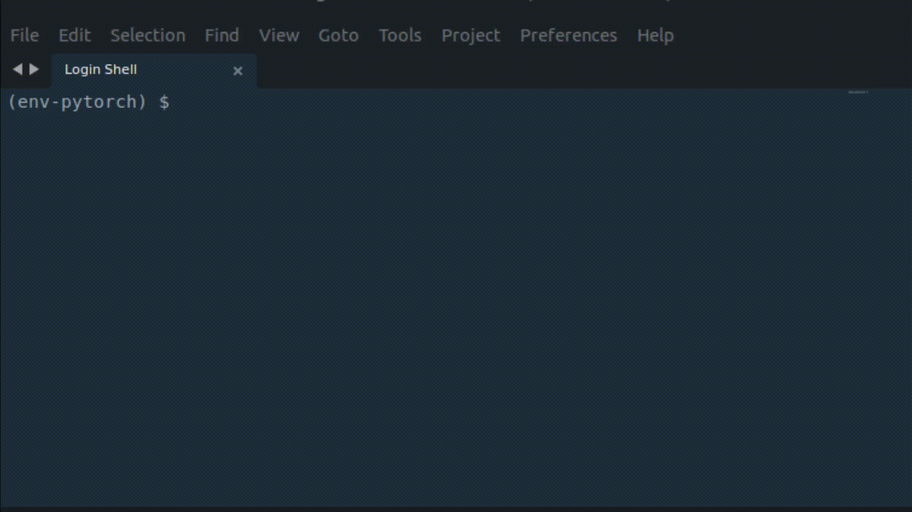

# Covid Detection from Chest Xray, Production Code Example

Covid19 detection with Deep Learning Methods.\
Kaggle Covid Dataset and PyTorch were used. \
`evaluate_xray` is to evaluate X-ray images to predict Covid19 caused lung inflammation.

**Simple Application Flow:**\
An Image (User Input) -> Image transform -> Inference (forward pass to DL Model for CPU) -> Prediction (Terminal Output)

---
**How to use it ?** 

**To run the Covid19 detection program preferably in a virtual environment:**  
Command -> `git clone https://github.com/rootloginson/repository_name`\
Command -> `pip install -r /path_to/requirements.txt`\
Command -> `python evaluate_xray.py -img 'imagename'`  

[*Requirements:*](requirements.txt)    
Pillow==9.0.1 \
torch==1.10.2 \
torchvision==0.11.3

***-img***  is for argparser to pass an image name as a string. 

If image is in the same directory as the python files pass only the name. If not, pass 'directoryname/imagename'. 

Example commands:  
`python evaluate_xray.py -img normal_chest_xray.jpeg`\
`python evaluate_xray.py -img covid_chest_xray.jpeg` 

*normal_chest_xray.jpeg* and *covid_chest_xray.jpeg* randomly selected from google images. They are not belong to the training, test or validation set.  

**To run the unittests:**
 > cd ../code_tests  
 > python test_run_unittest.py  

&nbsp;

**A demonstration:**

---

&nbsp;

### **Distilled outcome of this project:**

As Andrew Ng mentioned:

> It turns out that when we collect data from Stanford Hospital, then we train and test on data from the same hospital, indeed, we can publish papers showing [the algorithms] are comparable to human radiologists in spotting certain conditions. It turns out [that when] you take that same model, that same AI system, to an older hospital down the street, with an older machine, and the technician uses a slightly different imaging protocol, that data drifts to cause the performance of AI system to degrade significantly. In contrast, any human radiologist can walk down the street to the older hospital and do just fine. So even though at a moment in time, on a specific data set, we can show this works, the clinical reality is that these models still need a lot of work to reach production."
    
Article reference: https://spectrum.ieee.org/andrew-ng-xrays-the-ai-hype

---

